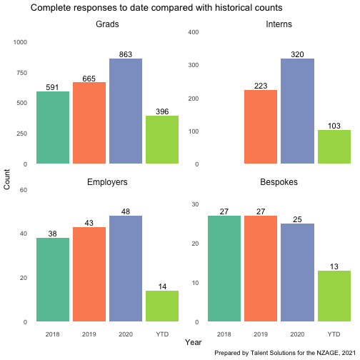
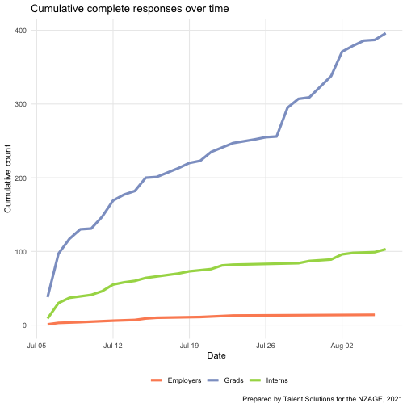

___Update as of 2021-08-07 17:37.___

## Progress so far

The below charts show how we're tracking for **complete** graduate, intern and employer surveys, as well as how many bespoke reports have been earned. 

#### Note on bespoke reports
An organisation earns a bespoke report when 10 or more of their graduates complete the graduate survey. They must also be a member of the NZAGE—this update data only reflects whether they have 10 or more complete graduate response. Double check NZAGE status before confirming with an organisation.

### Responses over time

## Summary by organisation

